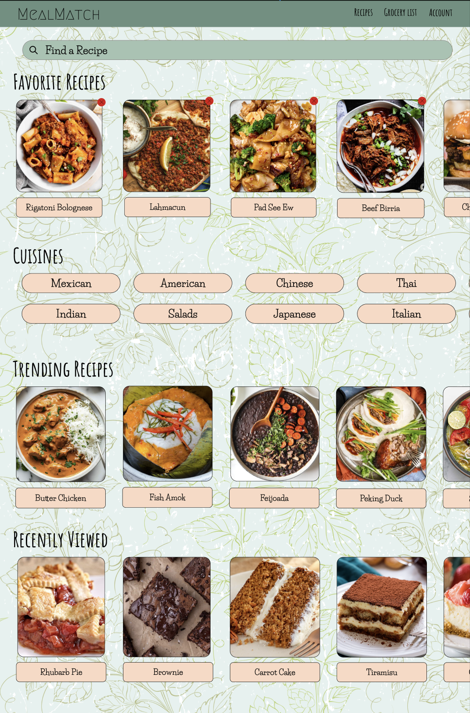
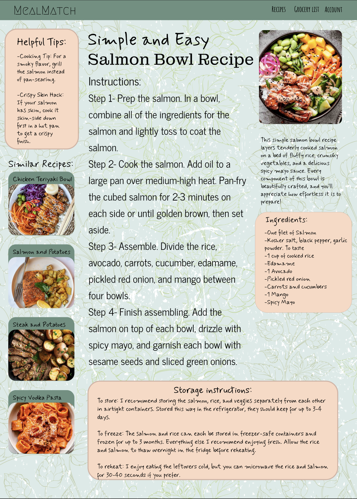
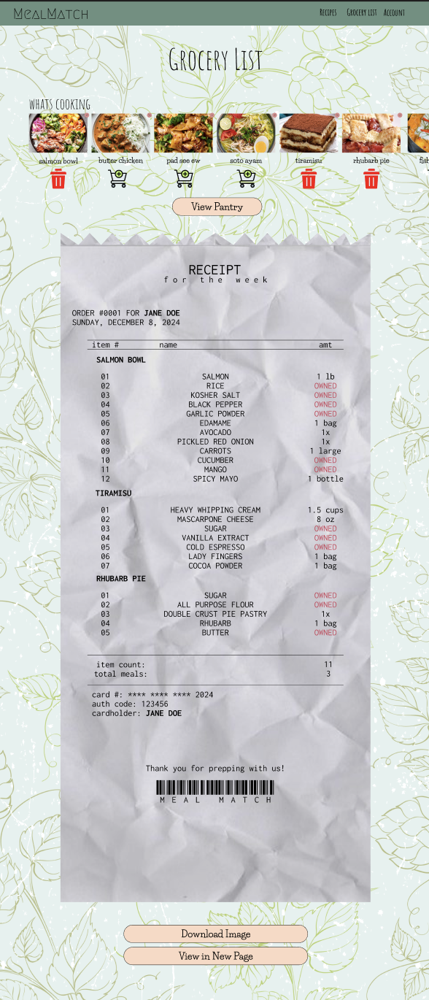

**CMSI 3700** Interaction Design, Fall 2024

# Dream Design Report 

# MealMatch: Your Personalized Meal Planner

- Raihana Zahra
- Z Anderson
- Giselle Eliasi

## Backstory

MealMatch was inspired by a common challenge our group faced as college students—repetitive meals and indecisive grocery shopping. Despite our shared love for cooking, we often found ourselves reaching for the easiest and most convenient meals or struggling to decide what to buy at the store. This app is designed to tackle that issue by connecting recipes with a personalized grocery shopping experience tailored to what users already have in their pantry or fridge. MealMatch streamlines the cooking process by reducing the stress of meal planning and eliminating the guesswork of remembering what ingredients are on hand.

The application offers a variety of dishes from different cuisines and meal types (e.g., breakfast, lunch, dinner), catering to diverse tastes and preferences. Our team is passionate about creating a platform that makes meal planning engaging and efficient, encouraging more people to embrace home cooking rather than relying on takeout or fast food. By promoting healthy eating habits and reallocating costs that would otherwise go toward dining out, MealMatch has the potential to positively impact users’ lives.

By combining thoughtful functionality with a user-friendly interface, MealMatch simplifies cooking and fosters a more enjoyable and sustainable relationship with food.

### Inspiration

We were able to get lots of inspiration from existing meal-planning apps like Mealime and Paprika. These platforms offer recipe suggestions and shopping list features but often lack integration of our pantry management. Our goal of MealMatch was to incorporate all of these elements for a cohesive and holistic platform that enhances the meal-planning experience. We also looked at apps like Tasty for their visually engaging recipe displays and user-friendly interfaces. On the other side, we learned from the limitations of grocery delivery apps, which sometimes overwhelm users with overly generalized suggestions or lack personalization. Additionally, we gained feedback from friends and family who find meal planning tedious showed the need for a tool that simplifies this process. All of these platforms guided our focus on creating a tailored experience that emphasizes user preferences, reduces food waste through smart inventory management and delivers a cohesive and user-friendly interface.

## Designs and explanation

### Home Page

The Home Page was designed to foster a gentle user experience, specifically in creating an exciting experience for new and existing users. The Home Page offers users an assortment of targeted experiences for varying interests and uses. 

The Home Page features three recipe carousels and one cuisine carousel for a user to browse. The top-centre of the page also features a search bar, for users looking for a specific recipe or dish. The top-most recipe carousel spotlights the user's saved recipes for easy access, titled "Favorite Recipes". Nine recipes are displayed at one time, however more can be accessed by choosing "See More" at the end of the carousel. The carousel was put in the most convenient location for the user as I felt it was a key feature of out website. The "Cuisine" carousel is located directly below the "Favorite Recipes" carousel, and featues 16 cuisines a user way interact with. The "Cuisine" carousel is catered toward users who may not know exactly what recipe or dish they are interested in, but may have a style of food in mind. WHen users click any of the cuisine buttons, they are taken to a list of potential recipes within that cuisine. The last two recipe carousels are titled "Trending Recipes" and "Recently Viewed". "Trending Recipes" uses data on website traffic to populate the most popular (or favorited) dishes among all users, and highlights them in a carousel very similar to "Favourite Recipes". Lastly, the "Recently Viewed" carousel allows users to return to recipes they have most recently accessed. Like the "Favourite Recipes" carousel, there are up to nine recipes visible on the carousel, however a "See More" button can be clicked to view a longer list of recently viewed recipes.

I opted to display simple photos of recipes and their recipe names, rather than a comprehensive description of the creator, dietary details, etc., to simplify the page and mainting a gentle atmosphere. Similarly, the color and font choices were made to foster a calm atmosphere, which nicely complements the static floral background.

### Chosen Recipe

The design of the Chosen Recipe page was created with a focus on aesthetics and readability. I opted for a pastel color palette because it evokes a sense of freshness and aligns well with the theme of healthy, homemade meals. This also ensures that text is easy to read while maintaining a soft, polished look.

To improve readability, I divided the content into clearly defined sections. Key areas, such as the instructions, ingredients, and helpful tips, are set apart using shaded text boxes, which help guide the user’s eye without overwhelming the design. Each section has its own unique purpose, whether it's providing detailed steps, sharing tips for better results, or similar recipes for the users. The modular layout allows users to easily skim or focus on specific parts of the page, which is especially helpful when they’re in the middle of cooking.

The inclusion of vibrant images, particularly the featured salmon bowl, was intentional. The main image highlights the finished product, enticing users and giving them a visual goal to work toward. On the left sidebar, I added similar recipes with thumbnails to inspire users and encourage them to explore additional options. These thumbnails are deliberately smaller to avoid distracting from the primary recipe while still being large enough to catch attention. The recipe title itself is bold and central, immediately drawing users in and anchoring their attention to the page.

Overall, this isn’t just a regular recipe page—it’s meant to feel like a friendly little guide that’s easy to use and fun to come back to whenever someone needs a great meal idea!

### Grocery List 

The Grocery List page is designed to simplify the meal preparation process by compiling recipes and generating a tailored shopping list that differentiates between ingredients users already own and those they need to purchase. 

After saving a recipe during their exploration, it will be displayed at the top of the page with the recipe carousel. Users are meant to then add recipes to their shopping list using the cart icon or remove them with the trash icon, making recipe management straightforward and efficient. The recipe carousel allows users to view all the recipes saved to their account, providing a clear visualization of their selected dishes and how they contribute to the shopping list.

The color palette, consistent throughout the application, features a soft pastel-green background with a subtle leaf pattern. This design choice was made to align with the app’s theme, evoking a sense of freshness that complements the concepts of cooking and meal planning. The muted tones ensure readability and do not overwhelm the user, while the white background of the receipt provides high contrast for text, enhancing legibility. Accessibility was a key consideration in the design—text sizes are large and clear, interactive elements like the cart and trash icons are distinct and visually separable, and color is not the sole method of conveying information. These elements ensure the page is usable for individuals with varying visual abilities.

At the core of the page is the shopping list, presented as a digital receipt. The idea was influenced by how someone would normally check out of a grocery store with all their items. This format categorizes ingredients by recipes and clearly marking items as "OWNED" or listing the amount required for purchase. The crumpled paper texture was added to simulate a real receipt and make the experience feel somewhat realistic. To make it feel more authentic, details such as order numbers, cardholder names, a barcode and the date was added. Ideally, the card number's last digits would end with the current year, the date at the top would reflect the current date, and the name would reflect the account holder's name, to make the experience feel more relatable. Additional elements, such as the item count and total meals, help users gauge the scope of their shopping list, preventing them from feeling overwhelmed.

To enhance usability, the page offers two key actions: "Download Image," which allows users to save the receipt for easy access during shopping, and "View in New Page," for a more detailed, expanded view of the list. These features improve efficiency during shopping and help users visualize their grocery needs. Additionally, a "View Pantry" button provides seamless integration between the grocery list and the user’s pantry inventory, ensuring users are aware of what they already have at home and reducing the risk of over-purchasing.

By combining a visually appealing layout, seamless functionality, and creative details, the Grocery List page exemplifies MealMatch's mission to make meal planning simple, enjoyable, and sustainable.

## Design process post-mortem

When designing and creating this website, we wanted to create a fresh and inviting design that would leave users feeling calm and successful in their recipe searches. We began by establishing a color palette that was rooted in green tones, as we felt that most accurately portrayed the freshness we were looking for. We then began working through design elements that we wanted to include or avoid, like curved vs. sharp corners and fonts styles. We then took these ideas and worked through the first drafts of the pages, where we found that more color was necessary and that the overall pages felt bland. At that point, we added some red, added a floral background, and layered some messy splatter to soften the business of the design. Finally, we cleaned up the line thicknesses, font sizes, and overall orientations so they fit well and created a cohesive theme that ultimately fit our goals well.

## Heuristic description

### Home Page
- Mental Model:      
  - We envision users approaching this design with simplicity and curiosity. By presenting information in a gentle and simple manner, we intend that new and existing users will have a pleasant and sucessful experience. We aimed to align with users' mental model of categorical investigation when searching and exploring for recipes. The layout is purposefully grouped to promote exploration, while also prioritising convenience and efficiency.

- Design principles:      
  - **User Control and Freedom:** Users can personalise their home page by looking at different recipes and saving their favorite recipes. They also have the option to remove recipes from the home page that no longer suit their needs.
  - **Consistency:** The recipe page follows a consistent style, with matching fonts, colors, and box styles across all sections, making the interface predictable and easy to navigate.

- Usability metrics:      
  - **Satisfaction:** The colorful design, clean layout, and user-friendly instructions aim to create a delightful experience for the user. The carousels allow for users to explore the full offerings of the website, or to use only features that support pertian to their goals.        
  - **Efficiency:** By organizing the recipe and cuisine carousels by importance and necessity, users can conveniently and clearly achieve their goals.

### Chosen Recipe
- Mental Model:      
  - We envision users approaching this design with simplicity and clarity in mind. A user seeking to make a quick and healthy meal would start by skimming the large, bolded recipe title and the instructions section. By keeping the instructions concise and sequentially numbered, I aimed to align with users’ mental model of step-by-step cooking processes. The layout encourages exploration—users might be drawn to the “Similar Recipes” section for variety or to the “Helpful Tips” for guidance before starting.

- Design principles:      
  - **Visibility and Readability:** The text contrasts well with the background, ensuring that users of all ages can comfortably read it. Titles and sections are visually distinct for quick navigation.
  - **Consistency:** The recipe page follows a consistent style, with matching fonts, colors, and box styles across all sections, making the interface predictable and easy to navigate.
  - **Flexibility and Efficiency:** The modular design allows users to jump to the section they need without wading through unnecessary content, catering to both novice cooks and experienced chefs.

- Usability metrics:      
  - **Satisfaction:** The colorful design, clean layout, and user-friendly instructions aim to create a delightful experience for the user. The helpful tips and storage instructions add value by addressing common cooking challenges and ensuring the meal can be enjoyed later, further enhancing satisfaction.          
  - **Efficiency:** By organizing the recipe into clearly defined sections and using bullet points and numbering, the page facilitates quick navigation and understanding. Users can quickly identify what they need to do at each step, reducing cognitive load and saving time.            

### Grocery List 
- Mental Model:
  - We envision users approaching the Grocery List page with the expectation of familiar, straightforward meal planning. By presenting the shopping list as a digital receipt, the design aligns with the user's mental model of checking out at a grocery store. Grouping ingredients by recipes and marking them as "OWNED" or with quantities needed reflects the natural process of preparing a shopping list. Interactive elements like the cart and trash icons allow users to intuitively add or remove recipes, ensuring the experience feels both simple and efficient.
 
- Design principles:
  - **Consistency and Standards:** The design maintains consistent visual elements and navigation across the application, including a cohesive color palette and interactive icons. The consistent use of labels such as "OWNED" and the grouping of ingredients by recipe ensure users quickly understand how the page operates.
  - **Visibility of System Status:** The receipt dynamically updates to reflect selected recipes, clearly displaying which ingredients are already available and what needs to be purchased. Details like order numbers, item counts, and total meals provides users with immediate insight into the scope of their shopping list.
  - **Match Between System and Real World:** The crumpled paper receipt texture and inclusion of real-world elements such as cardholder names, barcodes, and item counts create a realistic shopping experience. These design choices ensure that the digital interface mirrors familiar physical interactions in real-world grocery shopping.
  - **User Control and Freedom:** Users can easily add or remove recipes from their list, access their pantry to check available ingredients, and download or view their shopping list in a new page. These features give users flexibility and control over their meal-planning process.
  - **Aesthetic and Minimalist Design:** The pastel-green background with a subtle leaf pattern evokes freshness and simplicity, keeping the focus on the essential content. The clean layout ensures that users are not overwhelmed by unnecessary elements, making the page inviting and easy to navigate.

- Usability metrics:
  - **Satisfaction:** The design creates an enjoyable and engaging user experience by incorporating vibrant visuals, tactile elements like the crumpled receipt, and personalized details such as the user’s name and current date. These features make the process feel tailored to the user and encourage to actively engage with the app and meal prepping.
  - **Efficiency:** The intuitive layout and clear organization of recipes and ingredients streamline the meal-planning process, allowing users to quickly find what they need. Practical features like the “Download Image” and “View Pantry” buttons further enhance efficiency by minimizing the time and effort required to complete tasks.

## Statement of Work
### Figma
- Z: Landing Page, Log In Page, Home Page
- Giselle: Recipe Generation Page, Chosen Recipe Page
- Raihana: Pantry Page, Grocery List Page

### Report
- Z: Design process post-mortem, Heuristic description, Designs and explanation
- Giselle: Inspiration, Heuristic description, Designs and explanation
- Raihana: Backstory, Heuristic description, Designs and explanation
